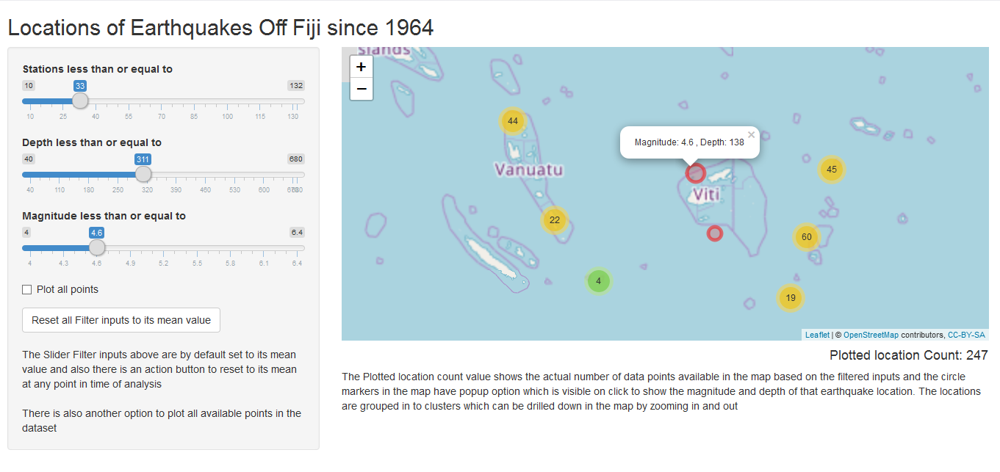

Interactive Map Visualization on Earthquakes off Fiji - Shiny App Course Project
========================================================
author: Vasudevan Durairaj
date: 08/June/2018
autosize: true


About the application
========================================================
width: 940
height: 529
This Shiny Application was built to analyze the Locations of Earthquakes recorded off Fiji since year 1964. It includes 1000 seismic events of MB > 4.0 as available in quakes dataset. 

- Simple UI with Side panel input filters like Stations, Depth and Magnitude of the seismic events recorded and they are defaulted with its mean value. Additional option to plot all points available in the data set and also an option to Reset all filter inputs to its mean value is present.

- The Interactive Map Visualization built using leaflet is plotted based on the filtered inputs applied on the dataset with circle markers clustered in to group. The Radius of circle markers is plotted in proportion to the depth of seismic event location.

The dataset
========================================================
width: 940
height: 529

The application is built based on the dataset "quakes"" which is available under datasets package in R. It is one of the Harvard PRIM-H project data sets which was in turn obtained from Dr. John Woodhouse, Dept. of Geophysics, Harvard University 


```r
## Structure of data set
str(quakes)
```

```
'data.frame':	1000 obs. of  5 variables:
 $ lat     : num  -20.4 -20.6 -26 -18 -20.4 ...
 $ long    : num  182 181 184 182 182 ...
 $ depth   : int  562 650 42 626 649 195 82 194 211 622 ...
 $ mag     : num  4.8 4.2 5.4 4.1 4 4 4.8 4.4 4.7 4.3 ...
 $ stations: int  41 15 43 19 11 12 43 15 35 19 ...
```

User Interface - Interactive Map Visualization
========================================================
width: 940
height: 529
Interactive map with zooming in/out functions and on click of circle markers, the popup is available with magnitude and depth of the seismic locations.



Application Resources
========================================================

Hosted Application Link 
<https://maddev.shinyapps.io/Earthquake_Visualization/>

Source Code Repository Link 
<https://github.com/Maddev25/DDP_CourseProject.git> 

Presentation document Link 
<http://rpubs.com/Maddev/fijiquakes> 
